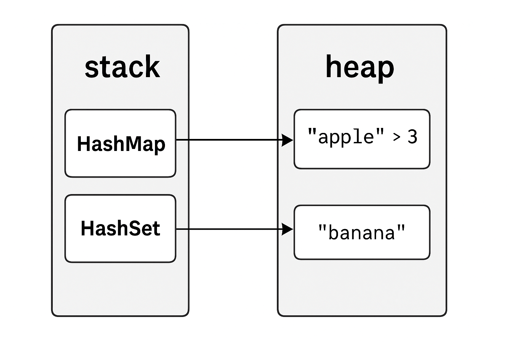

# 🧰 Data Structures

* * *

## 📝 Strings

* * *

## 📦 Array

### Features of an Array

    - Array are fixed size collection of same type elements.
    - Denoted by `[T; N]` where `T` is the type of the elements and `N` is the number of elements.
    - Array are contiguous/ordered i.e. they are stored in sequential memory blocks.
    - Array are fixed size i.e. once initialized cannot be resized.
    - Array are homogenous i.e. they contain only one type of data.
    - Memory for an Array is allocated in the stack because their size is fixed.
    - Array don't have header i.e Arrays are plain sequences in memory without extra metadata like heap-allocated types.
    - To identify array elements we use a unique integer known as a subscript i.e. index.
    - Values in the array element can be updated or modified but cannot be deleted.

* * *

## 📚 Vector

### Features of a Vector

    - Vector are dynamic size collection of same type elements.
    - Denoted by `Vec<T>` where `T` is the type of the elements.
    - Vector are contiguous/ordered i.e. they are stored in sequential memory blocks.
    - Vector are flexible i.e. they can be resized.
    - Vector are homogenous i.e. they contain only one type of data.
    - Memory for a Vector is allocated in the heap because their size is dynamic.
    - It’s not always exactly 2^n, but it grows exponentially, usually doubling.

* * *

## 🔗 Tuples

### Features of a Tuple

    - Tuple are collection of elements of different types.
    - Denoted by `(T1, T2, T3, ...)` where `T1, T2, T3, ...` are the types of the elements.
    - Tuples have a fixed layout, but since elements can have different types and alignments, they may not behave like a simple array in memory.
    - Tuple are fixed size i.e. once initialized cannot be resized.
    - Tuple are heterogeneous i.e. they contain different types of data.
    - Memory Allocation:
      - Tuple are stored in the stack if all their elements are themselves stack-allocated (like integers, fixed-size arrays, etc.).
      - The tuple itself is on the stack, but its elements may contain pointers to heap data (like String, Vec).
      - The tuple is just a container. It lives on the stack, and holds pointers to the heap if any of its fields do.
    - In tuples there is no inbuilt method to add elements into a tuple.
    - We can use the index to get the value of a tuple, and we can not iterate over a tuple using for loop.
    - Tuples don't support direct iteration or searching. Use pattern matching to destructure values.

```rust
    fn main() {
        let stack_tuple = (42, false); // Fully stack-allocated
        let heap_tuple = (vec![1, 2, 3], String::from("hi")); // Tuple on stack, data inside Vec and String on heap
    }
```

* * *

## 🗝️ HashMaps

### Features of a HashMap

    - HashMap are collection of key-value pairs.
    - Denoted by `HashMap<K, V>` where `K` is the type of the key and `V` is the type of the value.
    - Import from `std::collections::HashMap`.
    - HashMap are not contiguous/ordered i.e. they are not stored in sequential memory blocks.
    - HashMap are flexible i.e. they can be resized.
    - Each key and each value is of a single, uniform type — though key and value types can differ.
    - Memory for a HashMap is allocated in the heap.
      - The HashMap structure itself (the metadata: pointer to the table, capacity, etc.) is stored on the stack.
      - The actual key-value pairs are stored on the heap.
    - Keys are unique no duplicates allowed in the key but the value can be duplicated.
    - We can check for key in the HashMap by using the `contains_key` method. but cannot check for value.

```rust
    fn main() {
        use std::collections::HashMap;

        let mut map = HashMap::new();
        map.insert("apple", 3);  // heap: "apple" => 3
    
    }
    // map live on the stack (just small structs).
    // Their contents (key-value or key-only) are on the heap.
```

* * *

## 🎯 HashSets

### Features of a HashSet

    - HashSet are collection of unique values.
    - Denoted by `HashSet<T>` where `T` is the type of the value.
    - Import from `std::collections::HashSet`.
    - HashSet are not contiguous/ordered i.e. they are not stored in sequential memory blocks.
    - HashSet are flexible i.e. they can be resized.
    - HashSet are homogenous i.e. they contain only one type of data.
    - Memory for a HashSet is allocated in the heap.
      - Like HashMap, the set’s internal data lives on the heap.
      - Only the reference/pointer to this structure is on the stack.

```rust
    fn main() {
        use std::collections::HashSet;

        let mut set = HashSet::new();
        set.insert("apple");  // heap: "apple" stored as key
    }
    // set live on the stack (just small structs).
    // Their contents (key-only) are on the heap.
```



* * *

## 🏗️ Structs

### Features of a Struct

    - Structs are custom data types that let you group related data together.
    - Denoted by `struct Name { field1: Type1, field2: Type2, ... }`.
    - Memory Allocation:
      - Stack-allocated if all fields are stack types (e.g., integers, fixed arrays).
      - Heap-allocated if any field is heap-based (e.g., String, Vec<T>).
    - Immutability by Default:
      - Fields are immutable unless declared mut.
      - Use `mut` keyword to make fields mutable.
    - Ownership and Lifetimes: can add lifetimes to struct definitions for borrowing.
    - Struct Update Syntax: Create new structs from existing ones using .. syntax.
    - Pattern Matching: Structs can be destructured in let bindings or match expressions.

* * *

## 🎲 Enums

### Features of an Enum

    - Enums are custom data types that let you define a type by enumerating its possible variants.
    - Denoted by `enum Name { variant1, variant2, ... }`.
    - Variants with Data: Each variant can hold different and even multiple data types.
    - Memory Allocation:
        - Stack-allocated if all variants are stack types (e.g., integers, fixed arrays).
        - Heap-allocated if any variant contains heap-based types (e.g., String, Vec<T>).
    - Used with match: Enums are heavily used with pattern matching for control flow.

* * *

## Array vs Vector

### Array vs Vector Differences

- **Array**: Fixed-size collection of same-type elements
- **Vector**: Growable collection of same-type elements

### Array vs Vector Comparison

| Feature     | Array                                  | Vector                              |
|------------|----------------------------------------|-------------------------------------|
| Size       | Fixed at compile time                  | Growable at runtime                 |
| Memory     | Stack-allocated (small arrays)         | Heap-allocated                      |
| Flexibility| Rigid — compile-time size/type         | Flexible — runtime size changes     |
| Use Case   | Known, constant size                   | Dynamic or unknown size             |

> 💡 **Pro Tip**: Arrays can be heap-allocated using `Box<[T; N]>`, but stack allocation is more common.

## 🔑 HashMap vs HashSet

### HashMap vs HashSet Differences

- **HashMap**: Key-value pair collection
- **HashSet**: Unique value collection

### HashMap vs HashSet Comparison

| Feature   | HashMap                          | HashSet                             |
|-----------|----------------------------------|-------------------------------------|
| Structure | ✔️ Key-Value pairs                | ✔️ Unique values only                |
| Storage   | ✔️ Heap-allocated                 | ✔️ Heap-allocated                    |
| Ordering  | ✔️ Unordered                      | ✔️ Unordered                         |
| Use Case  | ✔️ Key-value mapping              | ✔️ Unique values storage             |

> 💡 **Pro Tip**: Both HashMap and HashSet are heap-allocated for dynamic memory management.

* * *

## ⏱️ Time Complexity Analysis

### String Operations

| Operation | Complexity | Notes |
|-----------|------------|-------|
| Insert (end) | O(1) | Amortized, because it's backed by a `Vec<u8>` |
| Insert (start/middle) | O(n) | Requires shifting |
| Delete | O(n) | UTF-8 validation |
| Search | O(n) | Pattern matching |

### Array Operations

| Operation | Complexity | Notes |
|-----------|------------|-------|
| Insert | O(n) | Cannot "insert" in-place; emulate with copy |
| Delete | O(n) | Shifting required / cannot resize |
| Search | O(n) | Linear scan |

### Vector Operations

| Operation | Complexity | Notes |
|-----------|------------|-------|
| Insert (end) | O(1) | Amortized |
| Insert (start/middle) | O(n) | Shifting required |
| Delete (end) | O(1) | Direct removal |
| Delete (start/middle) | O(n) | Shifting required |
| Search | O(n) | Linear scan |

### Tuple Operations

| Operation | Complexity | Notes |
|-----------|------------|-------|
| Access | O(1) | Compile-time index |

> 🧠 **Memory Note**: No dynamic insertion/deletion/search in tuples.

### HashMap Operations

| Operation | Complexity | Notes |
|-----------|------------|-------|
| Insert | O(1) avg, O(n) worst | Collision dependent |
| Delete | O(1) avg | Amortized |
| Search | O(1) avg, O(n) worst | Collision dependent |

### HashSet Operations

| Operation | Complexity | Notes |
|-----------|------------|-------|
| Insert | O(1) avg | Average case |
| Delete | O(1) avg | Average case |
| Search | O(1) avg | Average case |

* * *

## 💡 Performance Optimization Tips

> 🧠 **Pro Tip**: Choose data structures based on your access patterns:
>
> - Use `Vec<T>` for fast push/pop operations
> - Use `HashMap<K, V>` for fast key-value lookups
> - Prefer `&str` over `String` when mutation isn't needed
